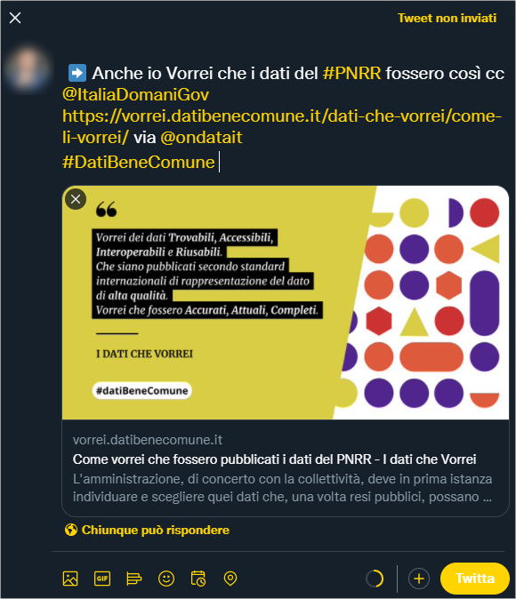

---
hide:
  - navigation
title: Partecipa
---

# Partecipa

**I dati che vorrei** è progetto che si svilupperà durante il 2022 e tra la prime cose che vedrai evolvere ci sarà ad esempio la pubblicazione delle [sezioni dedicate](/dati-che-vorrei/prossimamente/) ad alcuni degli **obiettivi trasversali** del **PNRR**.

Per seguire il progetto e/o parteciparvi, puoi farlo in questo modo:

- leggere 📣[**News di datiBeneComune**](https://www.datibenecomune.it/notizie/) e/o iscriverti al relativo :fontawesome-solid-rss:[feed RSS](https://www.datibenecomune.it/feed/);
- **correggere** e fare **proposte** sui **contenuti** di questo sito. Questo spazio è aperto sia in termini di licenza, che modalità di scrittura: è ✏️ [ospitato qui](https://github.com/ondata/i-dati-che-vorrei/) e (se sai usare GitHub) puoi fare le tue proposte di modifiche/integrazioni dei testi;
- utilizzare lo spazio di progetto per le :octicons-comment-discussion-24: [**discussioni**](https://github.com/ondata/i-dati-che-vorrei/discussions).

## Inserisci un tasto azione nei tuoi spazi online

Il **tasto** sottostante (provalo) fa partire al click un messaggio su Twitter, per dire che **anche tu** vuoi i dati del PNRR, come descritto in queste pagine.

[Vorrei che fossero così :fontawesome-brands-twitter:](https://twitter.com/intent/tweet?original_referer=https%3A%2F%2Fvorrei.datibenecomune.it%2Fdati-che-vorrei%2Fcome-li-vorrei%2F&amp;ref_src=twsrc%5Etfw%7Ctwcamp%5Ebuttonembed%7Ctwterm%5Eshare%7Ctwgr%5E&amp;text=%E2%9E%A1%EF%B8%8FAnche%20io%20Vorrei%20che%20i%20dati%20del%20%23PNRR%20fossero%20cos%C3%AC%20cc%20%40ItaliaDomaniGov&amp;url=https%3A%2F%2Fvorrei.datibenecomune.it%2Fdati-che-vorrei%2Fcome-li-vorrei%2F&amp;via=ondatait%0D%23DatiBeneComune){ .md-button .md-button--primary }

Se vuoi inserire qualcosa di simile sul tuo sito, in altri spazi online, ecc., basta che associ a un pulsante, un'immagine, o un testo, questo lungo *hyperlink*:

```
https://twitter.com/intent/tweet?original_referer=https%3A%2F%2Fvorrei.datibenecomune.it%2Fdati-che-vorrei%2Fcome-li-vorrei%2F&amp;ref_src=twsrc%5Etfw%7Ctwcamp%5Ebuttonembed%7Ctwterm%5Eshare%7Ctwgr%5E&amp;text=%E2%9E%A1%EF%B8%8FAnche%20io%20Vorrei%20che%20i%20dati%20del%20%23PNRR%20fossero%20cos%C3%AC%20cc%20%40ItaliaDomaniGov&amp;url=https%3A%2F%2Fvorrei.datibenecomune.it%2Fdati-che-vorrei%2Fcome-li-vorrei%2F&amp;via=ondatait%0D%23DatiBeneComune
```



## Contatti
Se vuoi un **contatto diretto** per approfondire, puoi scrivere un'**email** a [info@datibenecomune.it](mailto:info@datibenecomune.it) :material-email:.
